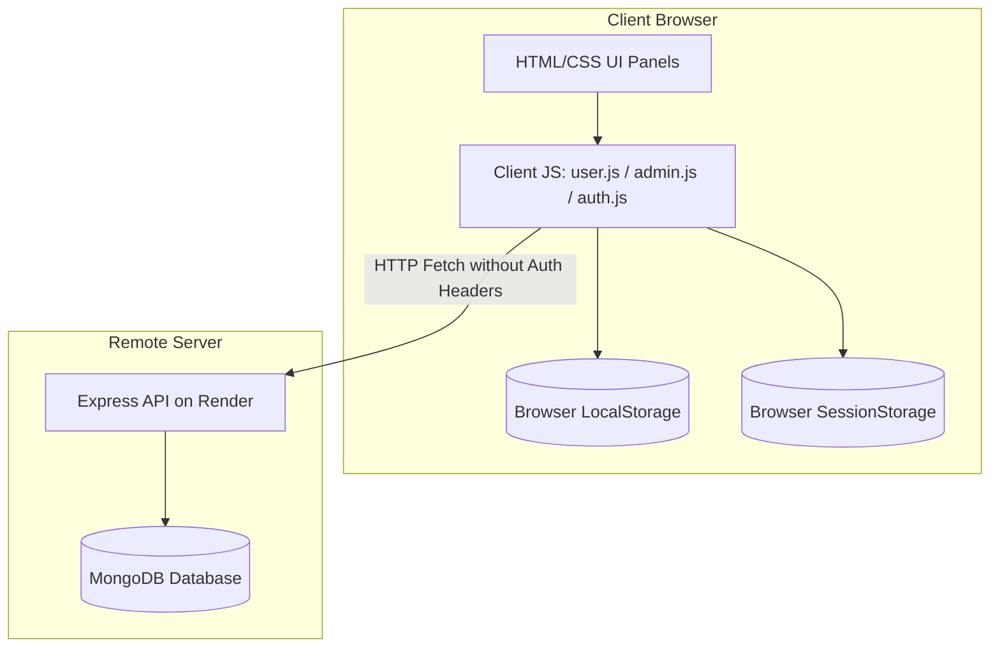
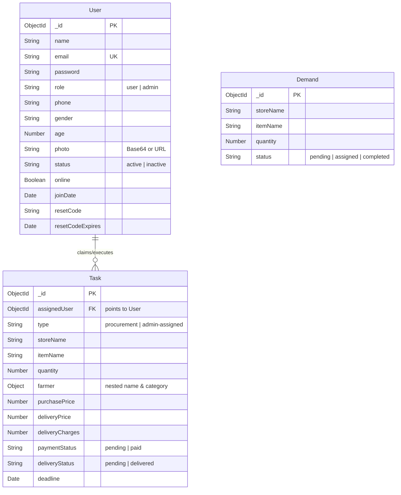

# FarmMart 2.0 Engineering Audit & Architectural Review

This document contains a comprehensive architectural and code audit of the existing **FarmMart** codebase. It outlines the current state, identifies security vulnerabilities, technical debt, and bugs, and defines a technical transition roadmap to **FarmMart 2.0**—a production-grade, farm-to-retail procurement platform.

---

## 1. Architectural Audits

### 1.1 Current Architecture Overview
The current system is a decoupled web application composed of:
1. **Frontend**: A static client application served via vanilla HTML, CSS, and JavaScript. It runs in a **dual-persistence mode**:
   * It attempts to query a hosted Node.js/Express API (`https://farmmart-backend-y6sn.onrender.com`).
   * If the API is unreachable, it silently falls back to client-side mock data operations utilizing `localStorage` and `sessionStorage`.
2. **Backend**: A Node.js Express server connected to MongoDB via Mongoose. It exposes a minimal REST API for users, demands, and tasks.



---

### 1.2 Frontend Architecture
* **Framework**: None. Built with vanilla HTML5, CSS3, and ES6+ JavaScript.
* **Routing**: Managed entirely client-side using manual DOM display updates (`active-panel` class toggling).
* **State Management**: Distributed across active DOM element states, temporary local variables, and persistent browser storage (`localStorage` for entities, `sessionStorage` for active session data).
* **Charts**: Handled through direct rendering on HTML5 `<canvas>` elements using raw 2D context drawing commands (`ctx.lineTo`, `ctx.arc`, etc.). No external charting library (e.g., Chart.js) is loaded.
* **Support Interface**: An interactive, client-side assistant (`chatbot.js`) that uses keyword-matching to respond, with local escalation to a "Pending Queries" queue.

---

### 1.3 Backend Architecture
* **Framework**: Express.js (`server.js`) listening on a configurable port.
* **Database Access**: Mongoose ODM.
* **Middleware**: Configured with `cors()` (fully open) and `express.json({ limit: '10mb' })` (enables large base64 image uploads).
* **Routes & Controllers**: Organized by resource groups:
  * `/api/auth` -> `authController.js` (User management, login, profile, passwords)
  * `/api/demands` -> `demandController.js` (Store demands retrieval, creation, status updates)
  * `/api/tasks` -> `taskController.js` (Procurement task claiming, payment, delivery status)
* **Authentication/Authorization Middlewares**: **NONE**. The backend does not verify incoming requests, decode JWTs, or restrict access based on roles.

---

### 1.4 Database Models and Relationships
The backend schema defines three MongoDB collections:



#### Schema Critical Analysis:
1. **Stores and Farmers**: Neither entity exists in the MongoDB database. Stores and Farmers are defined only as static mock arrays in the frontend (`js/data.js`) and saved to browser `localStorage` on initialization.
2. **Task-Farmer Relationship**: A Task references its farmer as a nested subdocument containing strings: `{ name: '', category: '' }`. There is no relational reference linking a task to a verified Farmer entity.
3. **Demand-Task Relationship**: When a user fulfills a demand, the frontend passes `demandId` to the task creation payload. The controller updates the Demand status but does not persist a reference inside the Task database entry.

---

### 1.5 Authentication Flow
1. **Backend login/signup**: 
   * `/api/auth/signup` takes credentials, generates a password hash via `bcryptjs`, saves the User record, and returns a signed JWT.
   * `/api/auth/login` checks the password hash and returns a JWT.
2. **Frontend Session Storage**:
   * The client stores this JWT in `sessionStorage.getItem('ftm_session')`.
3. **Authentication Gaps**:
   * **No Auth Headers**: The frontend does not append the JWT as a Bearer token in the `Authorization` header of subsequent API requests (`createTask`, `updateDemand`, etc.).
   * **No Server Verification**: The server never extracts, parses, or validates the JWT. The backend is completely open.
   * **Simulated Fallback**: If the server is down, login/signup simulates credentials matching using SHA-256 (via Web Crypto API `crypto.subtle`) against `localStorage.getItem('ftm_users')`.

---

### 1.6 Authorization Flow
* **Server-Side**: **NONE**. The backend contains no RBAC (Role-Based Access Control) or ABAC (Attribute-Based Access Control) logic. Every endpoint is publicly accessible. For instance:
  * Profile updates (`PUT /api/auth/profile`) determine which account to update based on a raw `userId` string passed in the JSON request body.
  * Task creation (`POST /api/tasks`) and task status updates (`PUT /api/tasks/:id/payment`) execute database updates without checking if the requester is an admin or the assigned user.
* **Client-Side**: Relies on soft client-side redirects:
  ```javascript
  const session = getSession();
  if (!session || session.role !== 'admin') {
    window.location.replace('../auth.html?role=admin');
    return;
  }
  ```
  This is easily bypassed by disabling JavaScript or calling endpoints directly via curl/Postman.

---

### 1.7 Current API Endpoints
The backend router exposes the following endpoints:

| Endpoint | Method | Body Payload / Parameters | Access Control | Description |
| :--- | :--- | :--- | :--- | :--- |
| `/api/auth/signup` | `POST` | `{ name, email, password, phone, gender, age, photo, role }` | Public | Registers a user or admin |
| `/api/auth/login` | `POST` | `{ email, password, role }` | Public | Validates credentials and returns JWT |
| `/api/auth/profile` | `PUT` | `{ userId, name, email, phone, gender, age, photo }` | Public | Updates user profile details |
| `/api/auth/password` | `POST` | `{ userId, currentPassword, newPassword }` | Public | Updates password from dashboard |
| `/api/auth/forgot-password`| `POST` | `{ email }` | Public | Generates and logs a 6-digit reset code |
| `/api/auth/reset-password` | `POST` | `{ email, code, newPassword }` | Public | Resets password using verification code |
| `/api/demands` | `GET` | None | Public | Retrieves all store demands (sorted by date) |
| `/api/demands` | `POST` | `{ storeName, itemName, quantity }` | Public | Creates a new store demand |
| `/api/demands/:id` | `PUT` | `{ status }` | Public | Updates demand status |
| `/api/tasks` | `GET` | Query param: `assignedUser` (optional) | Public | Retrieves tasks (supports filtering) |
| `/api/tasks` | `POST` | `{ assignedUser, type, storeName, itemName, quantity, farmer, purchasePrice, deliveryPrice, deliveryCharges, deadline, demandId }` | Public | Creates a task and links it to a demand |
| `/api/tasks/stats` | `GET` | Query param: `assignedUser` (optional) | Public | Retrieves aggregate metrics for tasks |
| `/api/tasks/:id` | `PUT` | `{ farmer, purchasePrice, deliveryPrice, deliveryCharges }` | Public | Updates task terms |
| `/api/tasks/:id/payment`| `PUT` | None | Public | Marks task payment status as `'paid'` |
| `/api/tasks/:id/delivery`| `PUT` | None | Public | Marks task delivery status as `'delivered'` |

---

### 1.8 Current User Roles
* **`admin`**: Intended to manage partner stores, farmer registries, create new demands, allocate tasks, resolve chatbot inquiries, and review system charts.
* **`user`**: Intended to act as a distributor/broker who claims store demands, assigns logistics pricing, negotiates with farmers, marks orders as delivered, clears payments, and raises support queries.
* *Note*: Distinct system roles for **Farmers** and **Retail Buyers** do not exist on either the frontend or backend.

---

### 1.9 Current Application Workflows
1. **Demand & Procurement Workflow**:
   * Admin posts a store demand (`POST /api/demands`).
   * Buyer views the active demands panel.
   * Buyer claims a demand by selecting a farmer, inputting purchase/selling prices, specifying delivery costs, and setting a deadline.
   * Fulfilling this form calls `POST /api/tasks` which locks in the task and changes the demand status to `assigned`.
2. **Order Payment & Delivery Order Rules**:
   * To complete a task, payment must first be marked as `'paid'` (`PUT /api/tasks/:id/payment`).
   * When marking a task as delivered (`PUT /api/tasks/:id/delivery`), the backend enforces a FIFO payment clearance rule:
     1. The task itself must be paid.
     2. There must be no older unpaid tasks (`paymentStatus: 'pending'`) assigned to that same user. If an older unpaid task exists, delivery is blocked.
3. **Escalation & Support**:
   * Users converse with `FarmAssistant AI` via the chatbot panel.
   * If a user asks for human assistance or triggers fallback keywords, the chat log performs an escalation.
   * Escalation calls `addQuery()` which creates a record in `localStorage` and simulates sending an email by printing to the server console log:
     ```text
     [MAIL SIMULATION] Reset code for user@domain: 123456
     ```

---

### 1.10 Existing Reusable React Components
* **None**. The current application is written in vanilla HTML, CSS, and JS. 
* There are no modular UI components, hooks, props, or state management frameworks in place. Page UI elements are built dynamically by creating and appending DOM elements:
  ```javascript
  const card = document.createElement('div');
  card.className = 'store-card';
  // ... manual appends
  ```

---

### 1.11 Existing UI/Design System
The UI implements a dark glassmorphic design language:
* **Typography**: Outfit font family from Google Fonts.
* **Colors**: Managed via CSS variables in `main.css`:
  * Main Backgrounds: `#060f0a` (Deep forest dark green) to `#030808`
  * Brand Highlights: Green (`--primary-light: #22c55e`, `--primary-dark: #15803d`) and Gold (`--gold: #eab308`)
  * Cards & Panels: Semi-transparent backgrounds with thin borders (`rgba(34,197,94,.08)`) and high backdrop-blur values (`14px` - `18px`).
* **Visual Effects**: Custom particle-field rendering, layout meshes, floating background orbs, and transition keyframes.

---

## 2. Technical Debt & Code Quality Issues

### 2.1 Critical Security Risks
1. **Broken Endpoint Authentication**: All endpoints on `/api/demands/*`, `/api/tasks/*`, and `/api/auth/profile` are public and completely ignore authorization. Attackers can call these endpoints to read, modify, or delete platform data.
2. **Broken Object Level Authorization (BOLA/IDOR)**: `PUT /api/auth/profile` and `POST /api/auth/password` update credentials based on a user-controlled `userId` in the body payload, allowing attackers to modify accounts or hijack passwords of other users by predicting or brute-forcing MongoDB ObjectIDs.
3. **Simulated Frontend-Only 2FA**: Admin registration checks a 2FA code generated and validated entirely in the client-side JavaScript (`auth.js:384-389`). An attacker can bypass 2FA check by calling `createUser()` directly or tampering with local JS execution.
4. **Weak Password Policy**: The backend schema allows passwords as short as 3 characters (`minlength: [3]`), which encourages extremely weak credentials (e.g., the default seeded password is `'admin'`).
5. **No Password Reset Token Security**: Password reset codes are 6-digit numeric codes generated and saved directly to the database. There is no cryptographic signature, rate-limiting on reset attempts, or hashing of reset codes.
6. **CORS Configuration**: CORS is configured to accept requests from all origins (`app.use(cors())`), allowing unauthorized cross-origin requests.

---

### 2.2 Bugs and Fragile Code Areas
1. **Malformed Default Admin Email**: The default seeded admin email in `authController.js` is `'admin@gmail.'`. This is a malformed string that fails standard email verification patterns, yet it is hardcoded as the default admin email across the system.
2. **Split-Brain Database Synchronization**: Because the application uses a silent client-side fallback, any data created while the backend is offline is saved only to that user's local browser storage. This creates a split-brain state where different users see different system logs, and data is permanently lost once browser cache is cleared.
3. **Seeded Credentials Leak**: Default admin password `'admin'` and user password `'user@123'` are seeded directly on server start. These must be replaced with secure, environment-defined credentials.
4. **Base64 Photo Upload Payload Size**: The Express body parser allows payloads up to 10MB (`express.json({ limit: '10mb' })`). Users can upload uncompressed photos that are stored as huge base64 strings directly in MongoDB. This can quickly exhaust database storage and degrade query performance.

---

### 2.3 Code Duplication
1. **Profile Updating Logic**: The exact same logic for updating username, email, phone, age, and photos is duplicated across `admin.js` and `user.js`.
2. **Toast Notification System**: The code for generating and dismissing toast notification boxes is duplicated in `auth.js`, `admin.js`, and `user.js`.
3. **Local Storage Synchronization**: Functions to sync local storage values and manage browser session states are duplicated across all client scripts.
4. **Canvas Charting Methods**: Custom drawing calculations for bar and line charts are copied across `admin.js` and `user.js`.

---

### 2.4 Poor Separation of Concerns
1. **Massive Frontend Monoliths**: `admin.js` (~2.4k lines) and `user.js` (~1.5k lines) mix page state, event handlers, DOM builders, canvas rendering calculations, data sorting, validation, and network fetching into single, massive scopes.
2. **Log-Polluted Business Logic**: Controllers contain simulation code (e.g., mock email outputs printed directly to `console.log`) mixed with database query execution.
3. **Direct HTML Manipulation of Databases**: Data transformation logic (such as converting string inputs, calculating completion percentages, and formatting currency symbols) is handled directly inside the UI render loops.

---

### 2.5 Missing Validation & Error Handling
1. **Missing Numerical Boundary Checks**: The backend does not check if prices (`purchasePrice`, `deliveryPrice`) or quantities are negative numbers, or if deadlines are valid dates in the future.
2. **Role Hijacking on Registration**: `/api/auth/signup` takes the `role` field directly from the client request payload. Any user can sign up as an administrator by sending `{ "role": "admin" }` in the POST payload.
3. **Leaky/Malformed Server Errors**: Database transaction failures dump raw Mongoose/MongoDB error objects directly to the client response, exposing system collection names, field schemas, and server internals.
4. **No Centralized Express Error Handler**: Errors are caught in local try-catch blocks and returned as standard 500 statuses. There is no centralized error handling middleware to sanitize and log system issues.

---

### 2.6 Database Indexing Opportunities
1. **Task Queries**: `getTasks()` filters by `assignedUser` and sorts by `createdAt` in descending order:
   ```javascript
   const tasks = await Task.find({ assignedUser }).sort({ createdAt: -1 });
   ```
   An index should be added to:
   ```javascript
   taskSchema.index({ assignedUser: 1, createdAt: -1 });
   ```
2. **FIFO Delivery Validation Query**: `updateTaskDelivery` queries tasks by `assignedUser`, `paymentStatus`, and `createdAt` comparison:
   ```javascript
   const olderUnpaidTask = await Task.findOne({
     assignedUser: task.assignedUser,
     paymentStatus: 'pending',
     createdAt: { $lt: task.createdAt }
   });
   ```
   An index should be added to optimize this query and avoid full collection scans as task logs grow:
   ```javascript
   taskSchema.index({ assignedUser: 1, paymentStatus: 1, createdAt: 1 });
   ```
3. **User Identity Lookup**:
   ```javascript
   userSchema.index({ email: 1, role: 1 });
   ```

---

### 2.7 Performance Issues
1. **Render Cold Start Delays**: The backend is hosted on a free Render tier, which spins down after 15 minutes of inactivity. This causes a cold-start delay of up to 50 seconds on initial page load.
2. **Canvas Redraw Performance**: The custom canvas-based charts redraw from scratch on every window resize or tab switch, causing lag on lower-spec mobile devices.
3. **Synchronous File Parsing**: Parsing profile picture files as Base64 data URLs is handled synchronously on the main thread, blocking UI transitions during user registration and updates.

---

### 2.8 Accessibility Gaps (a11y)
1. **Missing Labels**: Custom select boxes, search inputs, and dashboard hamburger toggle buttons lack descriptive `aria-label` tags.
2. **Keyboard Navigation Traps**: Modals do not manage focus states. When a modal opens, focus remains on the background elements, making keyboard-only navigation difficult.
3. **Low Color Contrast**: Light green text (`#86efac`, opacity `0.45`) against dark backgrounds (`#060f0a`) violates WCAG AA color contrast guidelines (requires at least 4.5:1).

---

### 2.9 Responsive Design Issues
1. **Height-Locked Viewports**: The landing page uses a fixed-height layout:
   ```css
   html, body { height: 100%; overflow: hidden; }
   ```
   On small viewports or rotated devices, the forms and card elements exceed the screen height and are cut off because scrolling is disabled.
2. **Table Overflows**: Dashboard data tables do not have responsive scroll wrappers, causing the layout to break horizontally on small screens.

---

### 2.10 Testing & DevOps Gaps
1. **Testing Coverage**: **0%**. There are no unit, integration, or end-to-end tests.
2. **CI/CD Pipelines**: No automated linting, security audits, or build pipelines exist. Deployments are triggered manually from git branches.
3. **Environment Segregation**: The application does not distinguish between development, staging, and production environments.

---

## 3. FarmMart 2.0 Target Comparison

The following table maps the gaps between the current codebase and the target requirements for **FarmMart 2.0**:

| Feature / Goal | Current Codebase State | FarmMart 2.0 Target State | Required Action |
| :--- | :--- | :--- | :--- |
| **System Roles** | `user` and `admin` only. | `Farmer`, `Buyer`, and `Admin`. | Add distinct schemas/roles for Farmers and Buyers, and update signup flows. |
| **Product Listings** | Stored client-side in a static array. | Managed in a backend database. | Create a `Product` model and build CRUD APIs. |
| **Buyer Demands** | Basic schema, no link to a Buyer profile. | Tied to verified Buyer profiles. | Update the `Demand` model to reference a Buyer User ID. |
| **Farmer Offers** | Not supported. | Farmers can post crop offers. | Create an `Offer` model and matching API. |
| **Negotiation** | None. Prices are set directly by buyers. | Multi-party negotiation on offers/demands. | Implement a negotiation state machine and audit logs. |
| **Order Management** | Procurement tasks serve as basic orders. | Structured order states and lifecycles. | Build an `Order` system with clear status transitions. |
| **Shipment Tracking** | Boolean delivery status indicator. | Real-time shipment status tracking. | Add a tracking model with status history. |
| **Notifications** | None. | Real-time app notifications. | Integrate a notification engine (WebSockets/SSE). |
| **Supplier Matching** | None. Matching is done manually. | Explainable matching algorithm. | Implement matching logic based on price, rating, and location. |
| **Frontend Framework** | Vanilla HTML/JS. | Production React application. | Rebuild the frontend using React (Vite/Next.js). |
| **Backend & Security** | Public API, no JWT verification. | Secure REST API with strict RBAC. | Add JWT verification middleware and role checks. |
| **API Documentation** | None. | Swagger/OpenAPI documentation. | Add OpenAPI specifications for all endpoints. |

---

## 4. Priority Roadmap & Recommendations

### A. Critical Issues (Must Address Immediately)
1. **Implement Server-Side JWT Verification**: Create an authentication middleware (`authMiddleware.js`) to verify signed JWTs on all private backend routes.
2. **Add Role-Based Access Control (RBAC)**: Secure endpoints with role checks (e.g., `checkRole(['admin'])`).
3. **Secure User Profile and Password Edits**: Validate that the `userId` in update requests matches the authenticated user's ID from the JWT.
4. **Move Simulated 2FA to the Server**: Generate and verify admin registration codes on the backend.
5. **Secure the Signup Route**: Restrict role assignment during registration so users cannot sign up as admins.

---

### B. High Priority Issues
1. **Rebuild Frontend with React**: Set up a React application with a component library (e.g., Tailwind CSS, shadcn/ui) and structure it with reusable components.
2. **Migrate Local Data to MongoDB**: Create database models for `Store`, `Farmer`, `Product`, and `Query`, and migrate all static mock data.
3. **Add Database Indices**: Index the `Task` and `Demand` collections to optimize query performance.
4. **Implement Centralized Error Handling**: Build a global Express error handler to sanitize error responses and prevent leakage of database internals.

---

### C. Medium Priority Issues
1. **Implement Negotiation Logic**: Create a negotiation schema to track price offers and counter-offers between Buyers and Farmers.
2. **Build a Real-Time Notification System**: Implement WebSockets or Server-Sent Events (SSE) to notify users of negotiation updates and order status changes.
3. **Add Input Validation**: Use validation libraries (e.g., `express-validator` or `zod`) to sanitize inputs (e.g., check for positive prices and quantities).
4. **Implement Explainable Supplier Matching**: Build a service that ranks farmers for store demands based on location, crop category, rating, and historical completion rates, displaying the match criteria clearly to the buyer.


---

### D. Low Priority Improvements
1. **Introduce API Documentation**: Build and host Swagger/OpenAPI interactive docs to assist frontend developers and partner integrations.
2. **Resolve Accessibility Gaps**: Add ARIA labels to form elements, manage keyboard focus traps in modals, and improve contrast ratios.
3. **Fix Malformed Seed Emails**: Correct the default seeded email domain (`admin@gmail.`) to a valid email format.
4. **Environment Variables Config Validation**: Add validation to ensure all required `.env` values (like `JWT_SECRET` and `MONGO_URI`) are present on startup.

---

### E. Recommended Implementation Order

```mermaid
grid-layout
    Phase 1: "Security & Backend Hardening"
    Phase 2: "Database Migration & Schema Updates"
    Phase 3: "React Frontend Rebuild"
    Phase 4: "Core Features (Negotiation & Orders)"
    Phase 5: "Matching Engine & Analytics"
    Phase 6: "CI/CD, Testing & API Docs"
```

1. **Phase 1: Security & Backend Hardening**
   * Add JWT verification middleware.
   * Secure profile and password updates.
   * Move the admin 2FA verification process to the backend.
   * Restrict role assignment during registration.
2. **Phase 2: Database Migration & Schema Updates**
   * Create database schemas for `Store`, `Farmer`, `Product`, `Offer`, and `Query`.
   * Move all static local storage mock data to MongoDB.
   * Add indexes to the `Task` and `Demand` collections.
3. **Phase 3: React Frontend Rebuild**
   * Initialize a new React project using Vite.
   * Set up a router (e.g., React Router) and a state management library.
   * Build reusable UI components (buttons, cards, tables, modals).
4. **Phase 4: Core Features (Negotiation & Orders)**
   * Build negotiation and order management schemas.
   * Implement status transition rules for orders.
   * Set up real-time notifications for status updates.
5. **Phase 5: Matching Engine & Analytics**
   * Build the explainable supplier matching algorithm.
   * Develop analytics dashboards using a React charting library (e.g., Recharts).
6. **Phase 6: CI/CD, Testing & API Docs**
   * Add Jest unit tests and Cypress E2E tests.
   * Set up GitHub Actions for CI/CD pipelines.
   * Generate Swagger/OpenAPI documentation.

---

### F. Potential Breaking Changes
1. **JWT Requirement**: Requiring JWT tokens on the backend will break any client calls that do not include the `Authorization` header.
2. **Role Migrations**: Changing the `user` role to `Buyer` or `Farmer` will require migrating existing database records.
3. **Schema Normalization**: Storing Farmers and Stores as independent documents in the database will require updating the `Task` schema to reference their ObjectIDs instead of storing them as nested strings.

---

### G. Dependencies We Should Avoid Adding Unless Necessary
* **State Management Monoliths (Redux/MobX)**: Use React's Context API or lightweight libraries (e.g., Zustand) to keep state management simple.
* **Heavier UI Libraries**: Avoid heavy, opinionated UI libraries that increase bundle size and complicate custom styling. Stick to lightweight Tailwind-based components (e.g., shadcn/ui).
* **Babel/Webpack Custom Tooling**: Use Vite's native ESBuild tools instead of complex, custom build configurations.
