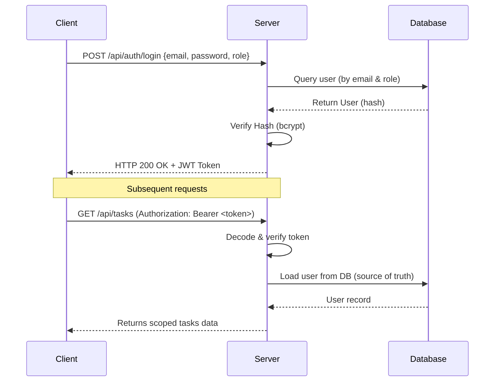

# FarmMart 2.0 Security Architecture & Policies

This document describes the authentication, authorization, and overall security design implemented in **FarmMart 2.0 Milestone 1: Backend Security Hardening**.

---

## 1. Authentication Architecture

FarmMart 2.0 uses standard stateless **JSON Web Tokens (JWT)** for session validation.



### JWT Flow Details:
- **Authorization Header**: The client sends the token in the `Authorization` header using the Bearer schema: `Authorization: Bearer <token>`.
- **Database Source of Truth**: The token payload contains only the user ID. The backend queries MongoDB (`User.findById`) for each request to obtain current status, roles, and info. If the user record is deleted or set to `inactive`, the request is immediately rejected.
- **Fail Safe**: The system fails safely if `JWT_SECRET` is missing in the environment.

---

## 2. Authorization & RBAC

The system implements Role-Based Access Control (RBAC) supporting the following roles:
- **`buyer`** (corresponds to brokers/distributors/retailers claiming demands and executing tasks)
- **`farmer`** (corresponds to crop producers/growers who can view profiles and store demands)
- **`admin`** (platform administrators with full management privileges)

### Scoping Rules:
- **Tasks & Stats**:
  - Regular `buyer` accounts can ONLY view, edit, and pay/deliver tasks assigned to themselves.
  - Access to all task endpoints is completely restricted from `farmer` accounts (returns `403 Forbidden`).
  - Requesting all tasks without a filter is restricted to `admin` accounts (returns `403 Forbidden` if requested by a normal buyer).
- **Demands**:
  - Creating demands (`POST /api/demands`) is restricted strictly to `admin`.
  - Claiming store demands (`PUT /api/demands/:id`) is permitted for `buyer` and `admin` roles, and denied for `farmer`.
  - Viewing demands (`GET /api/demands`) is an authenticated operation open to all roles.

---

## 3. Password Security & Policy

- **Hashing**: Passwords are never stored in plaintext. They are hashed using `bcryptjs` (salt round of 10) before saving in MongoDB.
- **Leakage Prevention**: The `password` field is excluded by default in Mongoose schemas (`select: false`), preventing it from leaking in queries, responses, or console logs.
- **Password Policy**: Enforces a server-side validation check of **minimum 8 characters** on:
  - User signup
  - Password change
  - Password reset

---

## 4. Password Reset Flow

Password resets are designed to prevent credential leaks and token hijacking:
1. **Token Generation**: Generates a cryptographically secure 6-digit random code using `crypto.randomInt`.
2. **Secure Hashing**: The server stores only the SHA-256 hash of the code in the database.
3. **Expiration**: Reset codes are set with a strict **15-minute expiration window**.
4. **Single-Use**: Reset codes are immediately invalidated (erased from the database) upon a successful password update.
5. **Privacy**: Reset codes are **never** returned in API responses or printed in console logs.

---

## 5. Rate Limiting

Sensitive authentication endpoints are protected against brute-force and DDoS attacks using `express-rate-limit`:
- **Target Endpoints**: Login, signup, forgot-password, reset-password.
- **Configuration**:
  - Max requests: 100 per IP
  - Window size: 15 minutes
  - Returns headers: `Ratelimit-Limit`, `Ratelimit-Remaining`, `Ratelimit-Reset` (standard draft and legacy headers).

---

## 6. CORS Policy

CORS is restricted to block unauthorized cross-origin requests:
- **Production**: Restricted strictly to the origin specified in `process.env.CLIENT_URL`.
- **Development**: Relaxes checks to allow local file systems and local hosts (`localhost`, `127.0.0.1`) if `NODE_ENV === 'development'`.

---

## 7. Centralized Error Handling & Environment Validation

- **Environment Validation**: Checks critical variables (`MONGODB_URI`, `JWT_SECRET`, `CLIENT_URL`) on server startup. The server immediately fails to start if any of these are missing.
- **Centralized Error Handler**: Translates errors into consistent response objects:
  ```json
  {
    "success": false,
    "error": {
      "code": "ERROR_CODE",
      "message": "User-friendly message"
    }
  }
  ```
- **Error Sanitization**: In production (`NODE_ENV === 'production'`), database internals, schema collections, validation errors, and stack traces are suppressed and replaced with generic message mappings (`DATABASE_ERROR`) to prevent information leakage.

---

## 8. Security Logging

Security-relevant events are logged to the console:
- Successful logins and signups (logging email and role)
- Failed login attempts (warning with reason)
- Unauthorized profile/password update attempts (warnings)
- Password reset actions
- **Secret Suppression**: Log files never capture passwords, tokens, reset codes, or sensitive PII.

---

## 9. Known Limitations

- **Email Delivery Service**: The platform currently lacks an integrated SMTP or SMS service provider. Reset codes are stored and matched, but cannot be received by end-users. Admin accounts must be created using the manual seed mechanism in this milestone.
